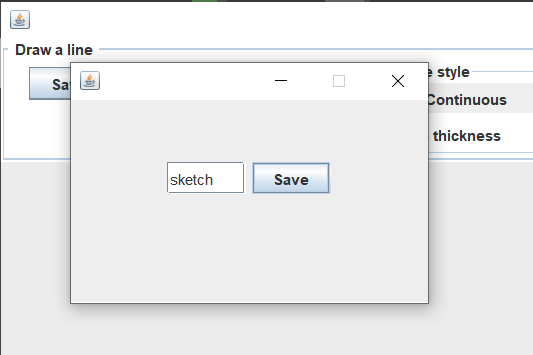

# Regular Poligon Playground  

RPP is an multiplatform aplication that allows to draw regular polygons of any number of sides.
 
Made for learning regular polygons while having fun drawing. 
Also allows to save your drawing.   


[](https://choosealicense.com/licenses/mit/)

## How to run

Clone the project

```bash
  git clone https://github.com/RepartidorEspacial/Regular-Polygon-Playground.git
```

Go to the project directory
```bash
  cd Regular_Polygon_Playground
```
Compile the RPP file 
```bash
  javac RPP.java
```
Then execute using java 
```bash
  java RPP
```


## Features

- Draw any regular polygon you want.  Introduce the number of faces you want in your polygon, then  click hold and release anywhere in the canvas


***
 
- You can choose the color, thickness and style of the line to be drawn. You can also translate , scale and rotate every drawn polygon independetly 


***

- Ereasing the whole canvas for a new drawing 
    

***
- Don't lose your work! Press the button "Save", choose the name of your image. Press save and your image will  be saved in the "saves" folder as a PNG file.


***
- There you have it! Your drawing in a lovely png file. 

